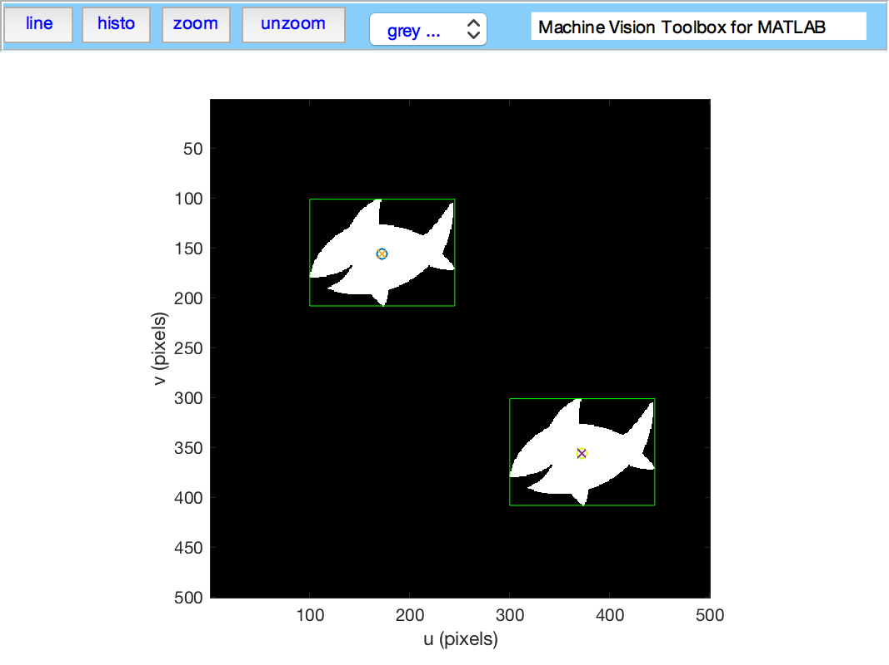

## Synopsis

Machine Vision Toolbox for MATLAB&reg; release 4.

The Machine Vision Toolbox (MVTB) provides many functions that are useful in machine vision and vision-based control.  It is a somewhat eclectic collection reflecting my personal interest in areas of photometry, photogrammetry, colorimetry.  It includes over 100 functions spanning operations such as image file reading and writing, acquisition, display, filtering, blob, point and line feature extraction,  mathematical morphology, homographies, visual Jacobians, camera calibration and color space conversion. With input from a web camera and output to a robot (not provided) it would be possible to implement a visual servo system entirely in MATLAB.

An image is usually treated as a rectangular array of scalar values representing intensity or perhaps range.  The matrix is the natural datatype for MATLAB and thus makes the manipulation of images easily expressible in terms of arithmetic statements in MATLAB language.  Many image operations such as thresholding, filtering and statistics can be achieved with existing MATLAB functions.

Advantages of the Toolbox are that:
  * the code is mature and provides a point of comparison for other implementations of the same algorithms;
  * the routines are generally written in a straightforward manner which allows for easy understanding, perhaps at the expense of computational efficiency. If you feel strongly about computational efficiency then you can always rewrite the function to be more efficient, compile the M-file using the MATLAB compiler, or create a MEX version;
  * since source code is available there is a benefit for understanding and teaching.

## Code Example

```matlab
>> im = iread('shark2.png');   % read a binary image of two sharks
>> idisp(im);   % display it with interactive viewing tool
>> f = iblobs(im, 'class', 1)  % find all the white blobs
f =
(1) area=7827, cent=(172.3,156.1), theta=-0.21, b/a=0.585, color=1, label=2, touch=0, parent=1
(2) area=7827, cent=(372.3,356.1), theta=-0.21, b/a=0.585, color=1, label=3, touch=0, parent=1
>> f.plot_box('g')  % put a green bounding box on each blob
>> f.plot_centroid('o');  % put a circle+cross on the centroid of each blob
>> f.plot_centroid('x');
```


## Installation from github

You need to have a recent version of MATLAB, R2016b or later.

The Machine Vision Toolbox for MATLAB has dependency on the repositories `robotics-toolbox-matlab` and `toolbox-common-matlab`.  

To install the Toolbox on your computer from github follow these simple instructions.

From the shell:
```shell
mkdir rvctools
cd rvctools
git clone https://github.com/petercorke/machinevision-toolbox-matlab.git vision
git clone https://github.com/petercorke/spatial-math.git smtb
git clone https://github.com/petercorke/toolbox-common-matlab.git common
```

If you want to use the Robotics Toolbox for MATLAB as well then do this
```shell
git clone https://github.com/petercorke/robotics-toolbox-matlab.git robot
```

From within MATLAB
```matlab
>> addpath rvctools/common  % rvctools is this is the same folder as above
>> startup_rvc
```
The second line sets up the MATLAB path appropriately but it's only for the current session.  You can either:
1. Repeat this everytime you start MATLAB
2. Add it to your `startup.m` file
3. Once you have run startup_rvc, run `pathtool` and push the `Save` button

## Downloading the example images

The Robotics, Vision & Control book (2nd edition) uses a number of example images and image sequences.  These are bulky and not really appropriate to keep on Github but you can download them.
There are two zip archives:

| Archive        | Size | Contents |
| -------------- | ----:| -------- |
images-RVC2a.zip | 74M  | All images, seq/\*, mosaic/\*, campus/\* |
images-RVC2a.zip | 255M | Chapter 14: bridge-l/\*, bridge-r/\* |

Each will expand into the `./images` folder which is the default location that MVTB searches for images and sequences.

To download the main (and smaller) archive
```shell
cd rvctools/vision
wget petercorke.com/files/MVTB/images-RVC2a.zip
unzip images-RVC2a
```

To download the second (and larger) archive
```shell
cd rvctools/vision
wget petercorke.com/files/MVTB/images-RVC2b.zip
unzip images-RVC2b
```


## Online resources:

* [Home page](http://www.petercorke.com)
* [Discussion group](http://groups.google.com/group/robotics-tool-box?hl=en)

Please email bug reports, comments or code contribtions to me at rvc@petercorke.com
  

## Contributors

Contributions welcome.  There's a user forum at http://tiny.cc/rvcforum

## License

This toolbox is released under GNU LGPL.
